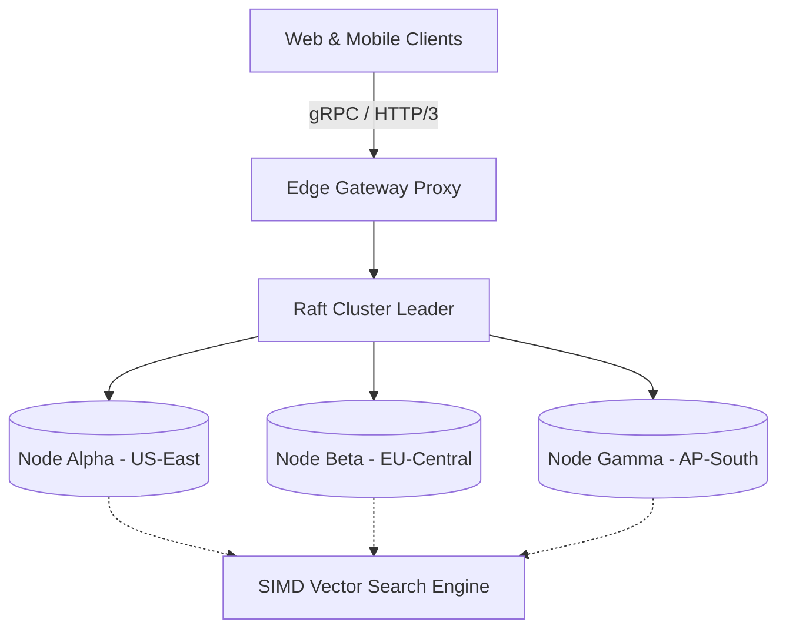

<div align="center">

# ⚡ ApexEngine

### The Next-Generation Edge Database for Real-Time AI Applications
**Sub-millisecond vector search, transactional consistency, and automatic sharding in a single binary.**

[](https://github.com/yourusername/apexengine/releases)
[](https://github.com/yourusername/apexengine)
[](https://hub.docker.com)
[](https://discord.gg)

```bash
# 🚀 Instant 5-Second Installation
curl -fsSL https://apexengine.dev/install.sh | sh && apex start
```

[Website](https://apexengine.dev) • [Documentation](https://docs.apexengine.dev) • [Discord Server](https://discord.gg) • [Twitter / X](https://twitter.com/apexengine)

---

</div>

## 💡 Why ApexEngine?

| Traditional Databases | ApexEngine |
| :--- | :--- |
| ❌ Complex multi-node sharding setups | ✅ **Zero-config Raft clustering out-of-the-box** |
| ❌ Slow external vector indexes | ✅ **In-memory HNSW vector search running at SIMD speed** |
| ❌ Heavy JVM or Python dependencies | ✅ **Compiled into a single 18MB static binary in Rust** |
| ❌ Expensive managed hosting bills | ✅ **Self-host anywhere or deploy to fly.io in 1 click** |

---

## 🏛️ System Architecture



---

## ⚡ Quick Start

```typescript
import { ApexClient } from '@apexengine/sdk';

const db = new ApexClient({ endpoint: 'http://localhost:8080' });

// Insert a vector embedding with arbitrary JSON metadata
await db.collection('documents').insert({
  id: 'doc_981',
  vector: [0.12, 0.94, -0.44, 0.81],
  metadata: { author: 'Alice', title: 'Deep Learning at Edge' }
});

// Query top 5 nearest neighbors
const results = await db.collection('documents').query({
  vector: [0.10, 0.92, -0.40, 0.85],
  topK: 5
});
```

---

## 🏆 Feature Matrix

- [x] Zero-copy deserialization via FlatBuffers
- [x] Raft Consensus algorithm with dynamic leader election
- [x] ACID compliant multi-statement transactions
- [x] Prometheus & OpenTelemetry native metrics export
- [ ] Distributed Cross-Region Replication (Target: v2.0)

---

## 👥 Backers & Enterprise Sponsors

Support this project on [GitHub Sponsors](https://github.com/sponsors/yourusername) to help keep it independently maintained!
